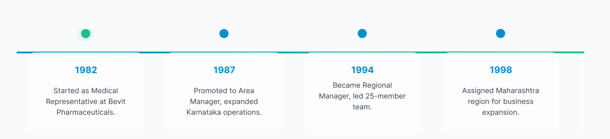

# ⏳ Timeline Journey UI

A modern and responsive timeline journey UI built using **pure HTML and CSS**.  
It includes a gradient progress line, timeline dots, clean event cards, and mobile responsiveness.

---

## 📸 Preview

---

## 🚀 Features

- 🎨 Smooth horizontal timeline design  
- 🟢 Left 10% green + 🔵 right blue gradient progress bar  
- 🔵 Centered dots representing timeline steps  
- 🗂 Clean and modern info cards  
- ⚡ Pure HTML & CSS (no JS required)  
- 🧩 Easy to customize and integrate in any website  

---

## 🛠️ Technologies Used

- **HTML5**
- **CSS3**
- Google Fonts (optional)

